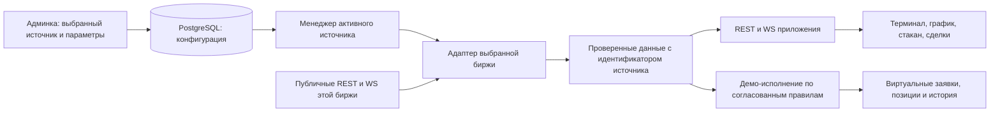

# Терминал: аудит реальных данных и план перехода

Дата: 2026-09-20. Область: `admin-project/webapp-admin/src/pages/exchanges`, основной backend, `bot/webapp/src/pages/trade` и их интеграция.

Ревизии исходников: `bot` — `40b2670a51dacc0185796b76342de1ab60406443`; `admin-project` — `6913984c477feba91c9af6f2c104ee7eff241cc0`. Анализ учитывает существующие незакоммиченные изменения. Код приложения, настройки, зависимости, БД и сохранённые пользовательские данные во время аудита не изменялись.

## 1. Зафиксированная цель

Пользователь выбрал **реальные рыночные данные и демо-сделки**. Баланс, заявки и исполнения остаются виртуальными. Генерация рыночных цен, свечей, объёмов, стакана и рыночных сделок должна исчезнуть из рабочего приложения.

Админка становится единственным местом выбора источника и настройки терминала. Фактические рыночные значения получает backend от биржи, выбранной в админке. WebApp обращается только к backend. Публичные каналы выбранной биржи допустимы: это тот же источник, которым управляет админка. Использование публичного API не означает использование сохранённого секретного ключа.

В отсутствие настроенного или доступного источника приложение показывает причину и время последнего обновления. Оно не подставляет mock-значения, нули вместо неизвестных величин или данные другой биржи.

Вопрос о работе демо-исполнения при закрытом WebApp вынесен пользователю отдельно. Общий план данных от ответа не зависит; варианты размещения симулятора описаны в разделе 7.

## 2. Подтверждённые наблюдения

Проверки проводились на запущенных локальных backend и Vite, а также на публичном API Bybit. Числа ниже отражают момент проверки, а не постоянный размер рынка.

| Проверка | Результат |
| --- | --- |
| `GET /api/trade/instruments` на backend | HTTP 200, 500 инструментов, цены ненулевые; присутствуют USDT и USDC; `SOLUSDT` и `XRPUSDT` отсутствуют. |
| Полный публичный каталог Bybit `linear` с `limit=1000` | 879 записей со статусом Trading, пустой следующий cursor; 771 USDT perpetual; `SOLUSDT` и `XRPUSDT` присутствуют. Есть и срочные, и бессрочные контракты. |
| WebSocket backend `/ws/market` | Получен snapshot из 500 инструментов и 149 updates примерно за 6 секунд; источник — Bybit. |
| REST-кэш против WebSocket snapshot | У 380 общих инструментов цены различались; код подтверждает, что REST-кэш после начальной загрузки не обновляется потоковыми сообщениями. |
| Конфигурация работающего Vite | `VITE_WS_URL` отсутствует; фактический fallback — `ws://localhost:8000`. |
| Локальная конфигурация Vite для development/production | API base настроен на `/api`; WS base не настроен. Собранный локальный bundle содержит localhost WebSocket. |
| `/api/trade/instruments` через Vite | HTTP 200. `/trade/instruments` без `/api` возвращает 404. WS через порт Vite не установился за время проверки. |
| Bybit price-only delta, изолированное выполнение текущего Python-кода | Процент и объём обнуляются. Изменение без `lastPrice` не рассылается. Начальная цена REST-кэша остаётся прежней. |
| Пустой ответ инструментов, изолированное выполнение текущего TS-store | Store очищается; выбранный инструмент отсутствует. Компоненты не предусматривают такое состояние. |
| Загрузка реальной цены в TS-store | Начальная цена лимитной заявки остаётся из mock-набора. |
| Две биржи с одним символом, изолированный ConnectionManager | В кэше остаётся одна запись; последняя биржа перезаписывает предыдущую. |
| Медленный клиент, изолированный ConnectionManager | Заблокированная отправка первому клиенту задерживает второго и завершение обработки входного события. |
| Явный `disconnect()`, изолированный market store | После close назначается новое подключение через 3 секунды. |

Изолированные проверки выполняли существующие функции с контролируемыми входами в памяти. Они не меняли живые соединения приложения или его БД.

## 3. Реестр найденных проблем

Приоритет P1: препятствует достоверному источнику, доступности терминала или корректному демо-исполнению. P2: надёжность, полнота, интерфейс и проверяемость. «Код» означает подтверждение чтением реализации; «воспроизведено» — дополнительную исполняемую проверку.

### Управление через админку

| ID | Приоритет | Проблема и следствие | Основание |
| --- | --- | --- | --- |
| A01 | P1 | Единого выбранного источника нет. Все активные записи запускают WS, chart endpoint выбирает первую запись, symbols endpoint использует Binance независимо от выбранной биржи. Нет модели среды, категории и валюты расчёта. | `Exchange`, `ExchangeRepo`, `ExchangeManager.start`, `charts.py`; код. |
| A02 | P1 | Создание/удаление записи не меняет работающий источник до перезапуска backend. Нет редактирования, проверки доступности, включения/выключения потока и статуса последнего сообщения. | Admin CRUD и lifecycle; код. |
| A03 | P2 | Форма предлагает восемь бирж; менеджер знает только Bybit/Binance, при этом Binance не заполняет каталог инструментов. Наличие карточки не означает работоспособность данных. Ключи обязательны в форме, но не нужны публичному потоку и не проверяются при сохранении. | Admin form, exchange routes, manager; код. |

### Транспорт и запуск

| ID | Приоритет | Проблема и следствие | Основание |
| --- | --- | --- | --- |
| T01 | P1 | WS fallback ведёт на компьютер/телефон пользователя. Для удалённого Telegram WebApp нужен адрес доступного backend и соответствующий `wss`. В dev proxy настроен только `/api`. | `useMarketStore.ts`, `vite.config.ts`; проверено на работающем Vite. |
| T02 | P2 | Явное отключение запускает reconnect; effect в App не выполняет cleanup. Нет защиты от callbacks старого socket и управляемого восстановления после background/online. | `useMarketStore.ts`, `App.tsx`; reconnect воспроизведён. |
| T03 | P1 | Инструменты загружаются единожды. Пустой ответ уничтожает набор; ошибки оставляют старые mock-данные. Fallback API base пропускает `/api`, хотя текущая локальная конфигурация его задаёт. | `fetchInstruments`; пустой набор и неверный маршрут воспроизведены. |

### Получение и целостность данных

| ID | Приоритет | Проблема и следствие | Основание |
| --- | --- | --- | --- |
| D01 | P1 | Не обрабатывается пагинация Bybit; подписка строится только для первой страницы. Обновление каталога связано с переподключением, отдельного обновления листингов нет. | `exchange_manager.py`; 500 против 879 подтверждено. |
| D02 | P1 | Delta трактуется как полный ticker. Отсутствующие значения становятся нулями; события без новой последней цены отбрасываются. | Bybit handler; воспроизведено, противоречит протоколу Bybit. |
| D03 | P1 | Есть отдельные REST/WS кэши и два frontend store с пересекающимися данными. Старый REST-ответ может перезаписать уже полученную цену. Ранее пришедший ticker не применяется к инструментам, добавленным позднее. Нет версии источника и согласованного snapshot. | Manager, ConnectionManager, App, market/crypto stores; код и сравнение кэшей. |
| D04 | P1 | `minNotional`, комиссии, maintenance margin и price band заданы константами. Не передаются все ограничения размера/плеча, risk tiers, актуальные price limits и funding. Такие числа нельзя выдавать за условия выбранной биржи. | Нормализация instrument и `InstrumentSpec`; код. |
| D05 | P1 | Загружаются USDT/USDC и разные типы linear-контрактов, но UI маркирует все как perpetual. Один числовой демо-баланс подписывается валютой выбранного инструмента: смена пары фактически переименовывает баланс без конвертации. | Каталог, SymbolSelectModal, BalanceInfo, PaperAccount; код и публичный каталог. |
| D06 | P1 | Нет возраста данных и статуса самого биржевого потока. `isConnected` сообщает только о WebApp↔backend. Нет протокольного ping, проверки subscription acknowledgements, явной политики коротких сетевых таймаутов/retCode и проверки входных чисел. При проблемах биржи клиент продолжает видеть старые данные как текущие. | ExchangeManager и WS contract; код. Отказ живой биржи не моделировался на рабочем сервисе. |

### Рассылка

| ID | Приоритет | Проблема и следствие | Основание |
| --- | --- | --- | --- |
| W01 | P1 | Ключ кэша — только symbol. Биржи/среды/категории не изолированы; snapshot сливается со старым набором вместо полной замены соответствующей версии. При смене источника старые записи могут сохраниться. | ConnectionManager и market store; перезапись двух источников воспроизведена. |
| W02 | P2 | Отправка всем клиентам выполняется последовательно внутри обработки биржевого события. Нет ограничения очередей/подписок; обновление любой пары копирует общие frontend maps. Один медленный клиент задерживает остальных и приём следующего события. | ConnectionManager; блокировка воспроизведена. Производственная нагрузка не измерялась. |

### Интерфейс и заглушки

| ID | Приоритет | Проблема и следствие | Основание |
| --- | --- | --- | --- |
| U01 | P1 | История графика генерируется локально. Цена изменяет только последнюю свечу со старым временем; OHLC не накапливается как поток свечей биржи. Bybit history adapter отсутствует. | ChartContainer, chartGenerator, LightweightChart, charts route; код. |
| U02 | P1 | Стакан и дисбаланс объёмов производятся из искусственных уровней. Формат объёма добавляет `K` без соответствующего масштабирования, шаг группировки выводится из decimals вместо точного tick size. | useOrderBookData; код. |
| U03 | P1 | Лента сделок генерируется из seed/времени устройства. После удаления tick-action `tickCounter` не растёт, поэтому прежняя логика обновления перестала работать. | useMarketTradesData, useCryptoStore, useMockDataEngine; код. |
| U04 | P1 | Mark Price равен Last Price. Суточные high/low/volume/turnover/OI застывают после REST. Поле WS `volume24h` фактически содержит оборот в quote; семантика объёма смешана. | Bybit handler, market store, ChartScreen, OrderBookCardModal; код. |
| U05 | P2 | Цена limit draft начинается с mock-цены и не переинициализируется при первом реальном snapshot. Начальные избранные и leverage restoration связаны с mock BTC. `isNew` всегда false, метаданные типа инструмента теряются. Заголовки выбора пары показывают сортировку, но её действия не реализованы. | Crypto store, persistence, selector; цена draft воспроизведена. |
| U06 | P2 | Эквивалент в гривнах рассчитывается по постоянному коэффициенту 44.64 без управляемого источника курса. | `formatApproximateFiat`; код. |
| U07 | P2 | Screener/Diary содержат пустые экраны; есть неработающие кнопки настроек/рисования/меню и Cross с «скоро». Выбор timeframe содержит интервалы, которых нет в стандартном API свечей Bybit. | Trade hub, модалки и Chart/types; код и документация Bybit. |

### Демо-счёт

| ID | Приоритет | Проблема и следствие | Основание |
| --- | --- | --- | --- |
| P01 | P1 | Симулятор получает последнюю цену раз в секунду без информации о свежести. TP/SL могут пропустить движение внутри секунды; Last используется вместо Mark для ликвидации. При старой цене нет запрета новых исполнений. | useMockDataEngine, processMarketTick, ActionButtons; код. |
| P02 | P1 | Engine работает только пока смонтирован CryptoScreen. На другой вкладке или после закрытия приложения заявки, TP/SL и ликвидации не обрабатываются. Backend `/trade/order` лишь возвращает вымышленный filled без сохранения. | CryptoScreen, hook и backend trade route; код. |
| P03 | P1 | localStorage не разделён по пользователю/источнику/среде/валюте. Проверка snapshot поверхностная. Старые позиции по mock-ценам могут получить новый PnL/ликвидацию при переключении на рынок; позиции без инструмента скрываются. Частые market updates переносят debounce сохранения. | useDemoPersistence, PositionsTab/OrdersTab, crypto store; код. |
| P04 | P1 | Исполнения происходят по Last или цене limit без реальной глубины/спреда и ограничений доступного объёма. Ликвидация упрощена, funding не учитывается; стартовый баланс 5300 задан в коде. Это допустимые элементы модели демо только при явных правилах, но не данные биржи. | paper engine/store, calculations; код. |

### Проверки

| ID | Приоритет | Проблема и следствие | Основание |
| --- | --- | --- | --- |
| Q01 | P2 | WebApp typecheck и lint сейчас падают; `npm test` успешно завершает процесс, исполнив 0 тестов. `pytest` отсутствует в текущем Python окружении. | Запуски проверок в ходе обсуждения; результаты в разделе 9. |
| Q02 | P1 | Имеющиеся Python market tests проверяют Binance helper, а не новый Bybit pipeline. API contract test читает лишь `apiClient.*` в фиксированных файлах, пропускает raw fetch/WS и ищет админку в отсутствующем `bot/admin`. | tests/unit/test_market_data.py, tests/integration/test_api_contract.py; код. |

Это реестр обнаруженных проблем в указанной области, не утверждение об отсутствии иных дефектов в проекте.

## 4. Как должен работать источник из админки

Обязательные свойства:

1. Один явно выбранный источник терминала. Наличие нескольких сохранённых карточек само по себе не запускает смешанный поток.
2. Конфигурация содержит provider, среду рыночных данных, category, contract/settlement scope, enabled и идентификатор версии. Начальный поддерживаемый вариант предлагается ограничить Bybit mainnet USDT perpetual: он соответствует текущему линейному демо-движку. Расширение категорий требует корректных отдельных валют счетов и правил контрактов.
3. Credentials остаются на backend в существующем зашифрованном хранилище. Публичные рыночные запросы выполняются без подписи; при получении точной комиссии аккаунта используется только read-only signed endpoint с ключом выбранной записи. Реальные ордера, переводы и изменения аккаунта биржи не входят в задачу.
4. Домены бирж принадлежат проверенным адаптерам backend. В админке выбирается provider/environment; произвольные адреса и секреты во frontend не передаются.
5. Активация, выключение и редактирование применяются после успешного commit БД. Для текущего одного runtime достаточно сверки версии сохранённой конфигурации менеджером; сначала задаётся измеримый срок применения, например до 5 секунд. Старые задачи завершаются с ожиданием, кэши и подписки инвалидируются согласованно.
6. При удалении/выключении источника терминал получает `unconfigured`/`disabled`, а не новую биржу или старый snapshot. Сохранённые демо-заявки и история не удаляются автоматически. Действия по уже существующим обязательствам описаны в разделе 7.
7. Если provider не реализован полностью, его нельзя выбрать как рабочий источник терминала. Existing записи других бирж сохраняются, но не объявляются поддерживаемыми без адаптера.
8. Карточка показывает отдельно статус конфигурации, доступность публичного потока, время последнего сообщения и результат проверки credentials, если они используются. Сохранение записи не выдаётся за успешное подключение.
9. Настройки демо-счёта — стартовая виртуальная сумма, валюта, поддерживаемая маржа и правила исполнения — также приходят из конфигурации backend, управляемой админкой. Они явно отделены от биржевых данных.

## 5. Источники каждого вида данных

| Данные | Авторитетный источник | Правило обработки |
| --- | --- | --- |
| Инструменты, ограничения шага/размера/плеча, settlement, тип контракта | Выбранная биржа: `instruments-info` | Все страницы; фильтр admin scope; точная нормализация decimal; периодическое обновление. |
| Last, Mark, Index, high/low, volume/turnover, OI, funding | REST tickers + WS tickers выбранного источника | Начальный snapshot и field-by-field delta; unknown остаётся unknown; разные цены и единицы не смешиваются. |
| История свечей | REST kline выбранного источника | Сортировка по времени, дедупликация, подгрузка более ранней истории, UTC-границы. |
| Обновления свечей | WS kline того же source/category/symbol/interval | Обновить текущую или добавить новую свечу по времени её начала; учесть `confirm`. |
| Стакан | WS orderbook с исходным snapshot | Новый snapshot заменяет книгу; delta меняет уровни; zero size удаляет уровень. После reconnect/resync ждать новую согласованную книгу. |
| Лента сделок | Recent public trades + WS publicTrade | Биржевые ID, время, сторона, цена, размер; дедупликация и ограниченный буфер. |
| Допустимые цены заявки | Биржевой price-limit endpoint/channel | Актуальные buy/sell limits с временем; отсутствие данных не заменяется ±10%. |
| Risk tiers / maintenance margin | Risk-limit API | Правильный tier и единицы, обновления правил; формула демо-ликвидации проверяется отдельно. |
| Комиссии | Account fee-rate выбранной записи, только чтение | Сохранить полученные ставки/время/происхождение. Если ставки недоступны, не подставлять старые константы и не открывать сделки с неизвестной стоимостью. |
| Funding в демо | Ставки и время выбранной биржи, при восстановлении — funding history | Отдельные виртуальные проводки с защитой от повторного начисления. |
| PnL, equity, собственные заявки/сделки | Демо-счёт и реальные рыночные события выбранного источника | Это вычисленные/симулированные данные; они не обозначаются как баланс или сделки реального аккаунта биржи. |
| Эквивалент в UAH | Не предусмотрен текущим источником терминала | Удалить отображение с коэффициентом 44.64. Показывать реальную settlement currency. Другой курс потребует отдельной управляемой настройки источника. |

Нативные интервалы Bybit: 1m, 3m, 5m, 15m, 30m, 1h, 2h, 4h, 6h, 12h, 1d, 1w, 1M. Ненативные варианты убрать из доступного выбора на первом этапе; не заполнять их сгенерированными свечами. Производные интервалы возможны позднее только агрегацией настоящих данных с определёнными границами и доступной историей.

Семантика snapshot/delta, интервалов и единиц сверена с официальной документацией: [ticker](https://bybit-exchange.github.io/docs/v5/websocket/public/ticker), [instruments](https://bybit-exchange.github.io/docs/v5/market/instrument), [orderbook](https://bybit-exchange.github.io/docs/v5/websocket/public/orderbook), [REST kline](https://bybit-exchange.github.io/docs/v5/market/kline), [WS kline](https://bybit-exchange.github.io/docs/v5/websocket/public/kline), [public trades](https://bybit-exchange.github.io/docs/v5/websocket/public/trade), [recent trades](https://bybit-exchange.github.io/docs/v5/market/recent-trade), [fee rate](https://bybit-exchange.github.io/docs/v5/account/fee-rate), [risk limits](https://bybit-exchange.github.io/docs/v5/market/risk-limit), [price limits](https://bybit-exchange.github.io/docs/v5/market/order-price-limit), [funding history](https://bybit-exchange.github.io/docs/v5/market/history-fund-rate).

## 6. План реализации

| Этап | Изменения | Критерий завершения |
| --- | --- | --- |
| 1. Зафиксировать контракт и воспроизведения | Описать source identity, данные по каждому каналу, состояния readiness/staleness, ошибки и capabilities. Добавить regression tests для уже воспроизведённых ошибок на существующих pytest/Node runner. Сделать отсутствие тестов ошибкой проверки. | Проверки воспроизводят перечисленные дефекты; независимые модели источника и демо-исполнения согласованы. |
| 2. Сделать админку владельцем источника | Расширить exchange schema/config миграцией, сохранив существующие encrypted credentials. Добавить выбор источника, scope, включение/выключение, редактирование, read-only проверку и health. Реализовать применение конфигурации runtime после commit. | Изменение admin source отражается в работающем терминале без перезапуска и без смешивания данных; неподдерживаемый источник отклоняется явно. |
| 3. Закончить Bybit adapter | Пагинация, фильтры типов/валют, snapshot+delta merge, все требуемые поля и ограничения; ping, timeout, ACK/error handling, backoff, восстановление и обновление каталога. Отделить health подключения от свежести каждого канала. | Полный каталог совпадает с выбранным scope API; частичные сообщения не стирают поля; после сбоя формируется новый корректный snapshot. |
| 4. Объединить REST/WS данные backend | Один актуальный нормализованный cache, source version, время биржи и приёма. REST history и public trades, канал подписок по инструменту/свечному интервалу. Ограниченные очереди клиентам; медленный клиент отсоединяется/ресинхронизируется, не тормозя upstream. | Новый клиент получает согласованное состояние; запоздалые события старого source отвергаются; имитация slow client не блокирует остальных. |
| 5. Перевести frontend на backend contract | Убрать localhost fallback, настроить same-origin WS и dev proxy. Отделить UI/draft store от единственного market store. Управлять запуском, отменой, reconnect и версиями запросов. Добавить loading/empty/error/stale состояния. | WebApp работает через HTTPS/Telegram без localhost; пустая конфигурация не падает; новый snapshot не затирается старым запросом; ручная цена пользователя не перезаписывается. |
| 6. Подключить все рыночные виджеты | Реальные OHLCV и WS kline, стакан, public trades, Mark/Index, 24h-поля и instrument metadata. Сортировка и избранные по настоящему каталогу. Реальный refresh и переключение symbol/timeframe с отменой старых запросов/подписок. | Все показанные рыночные числа прослеживаются до выбранного source; новые свечи появляются по времени; стакан и сделки подтверждаются биржевыми данными. |
| 7. Привязать демо-исполнение и историю | Выбранный вариант размещения из раздела 7; события с provenance/freshness; раздельные Last/Mark/Book; корректные ограничения, комиссии, риск и funding. Перенос старого demo state по правилам раздела 8. | Ордера используют свежий выбранный источник, повторные события не дублируют исполнение/комиссию; старые mock-позиции не исполняются автоматически на новых ценах. |
| 8. Удалить заглушки и обходные пути | Удалить рабочие mock generators/seeds и прямые Binance hooks после поиска всех вызовов. Перевести старые charts/symbols endpoints на общий source. Заменить fake `/trade/order` рабочим demo API либо удалить неиспользуемый endpoint. Screener — реальные ticker-фильтры; Diary — история демо-исполнений. Удалить пустые кнопки/неподдерживаемые режимы/UAH fallback. | В production graph нет генераторов рыночных данных, статических курсов, fake-success endpoints и открываемых пустых экранов. Тестовые fixtures остаются в тестах. |
| 9. Завершить проверки и документацию | Исправить typecheck/lint, интеграционные контракты обоих репозиториев, проверить migrations и отсутствие нулевого набора тестов. Проверить свежую сборку, Telegram mobile/desktop, reconnect, изменение источника и выбранный режим фоновой работы. Обновить архитектурные карты после реализации. | Все критерии раздела 10 выполнены; отчёт содержит фактические команды и результаты, без заявления об успешных непроведённых проверках. |

Порядок обязателен в существенной части: сначала единая конфигурация и достоверный data contract, затем виджеты и демо-исполнение. Подмена только URL WebSocket не решит остальную задачу.

## 7. Демо-исполнение и границы точности

Общее для обоих вариантов:

- Ключ счёта включает пользователя, источник/среду/категорию и settlement currency. Смена источника не переносит открытые позиции на цены другой биржи.
- Market buy/sell оценивается по соответствующим ask/bid и доступной наблюдаемой глубине. Частичное исполнение/недостаточная глубина должны иметь определённое поведение; искусственный объём не добавляется.
- Limit, reduce-only, cancel, reversal и TP/SL остаются реальными операциями симулятора с виртуальными средствами. Для лимитных заявок нужна документированная модель очереди: публичный стакан не позволяет обещать точное повторение реального исполнения на бирже.
- Unrealized PnL и ликвидация используют Mark, исполнения — реальные наблюдаемые цены/ликвидность. Тип триггера TP/SL фиксируется явно. Фактические биржевые комиссии/risk tiers используются как входы; симуляция остаётся симуляцией.
- Изменение risk tier, комиссий и спецификации не должно незаметно переписывать историю исполнений. В fill/ledger сохраняются применённые значения и источник.
- При stale/missing данных новые исполнения и переоценка останавливаются, отмена заявки разрешена. После пропуска данных нельзя выдумывать точную последовательность внутрисвечных цен или задним числом выдавать догадку за исполнение. Период недостоверности отмечается, восстановление следует определённой политике.
- Удаление/выключение admin source при существующих обязательствах приостанавливает этот счёт; история и заявки сохраняются. Новый источник обслуживает отдельный счёт. Возврат исходного источника не исполняет заявки до полной синхронизации.

### Вариант A: работа при закрытом WebApp

Рекомендуется, если от терминала ожидается постоянное исполнение заявок и TP/SL. Решение пользователя по этому вопросу ещё ожидается.

Перенести authoritative demo engine на backend. PostgreSQL хранит счета, заявки, позиции, fills и ledger; экономические изменения коммитятся атомарно. Пользователь определяется существующей Telegram auth dependency, чужие счета недоступны. Команды имеют idempotency key; обработка сериализуется для счёта, один приказ не исполняется дважды при повторе запроса/сообщения или рестарте. Для сумм/количеств использовать точные decimal значения.

Менеджер поддерживает нужные рыночные подписки для активных демо-обязательств независимо от подключённых UI. Промежуточные рыночные события, нужные engine, не теряются из-за ограничения частоты UI-рассылки. Жизненный цикл engine следует backend, а frontend читает snapshot/deltas и отправляет только demo-команды. Не добавлять отправку биржевых ордеров.

Выбрать один владеющий worker для каждой области исполнения; текущий однопроцессный запуск допустим. До включения нескольких workers нужны общая координация и проверка исключения двойного исполнения. После рестарта заявки восстанавливаются из БД; gap рыночных данных обрабатывается явно.

### Вариант B: работа только при открытом WebApp

Сохранить существующий чистый TS engine, переместив runtime из CryptoScreen в общий lifecycle приложения. Событийно подавать согласованные market events без секундного mock timer. Работа продолжается при переключении вкладок приложения, но не обещается при закрытом или приостановленном WebView. UI должен явно показывать это ограничение.

localStorage получает версию и разделение по пользователю/source/currency, полную проверку содержимого и надёжное сохранение значимых событий. Отключённый клиент не может достоверно восстановить все исполнения за пропущенный период; такой режим не эквивалентен постоянно работающему серверному счёту.

## 8. Сохранённые данные и удаление заглушек

Существующие записи бирж и encrypted credentials сохранить. Миграция добавляет поля и ограничения без автоматического удаления неподдерживаемых карточек. При неоднозначном наборе активных записей миграция не выбирает биржу случайно: админка требует явный выбор.

Существующий `crypto_terminal_demo_v1` не удалять и не импортировать как доверенный биржевой счёт. Пометить его как legacy mock history и предусмотреть просмотр/экспорт. Для live-market demo создать отдельную версию счёта со стартовыми средствами из admin policy; её создание должно быть явным пользователю. Перенос старых незакрытых позиций по новым рыночным ценам автоматически запрещён.

| Текущий элемент | Действие |
| --- | --- |
| `data/mockInstruments.ts` | Удалить seeds/default market values; вынести полезные чистые форматтеры и instrument types в нейтральные модули. |
| `engine/mockRandom.ts`, `Chart/data/chartGenerator.ts` | Удалить из runtime; детерминированные fixtures допустимы только в тестах. |
| `useMockDataEngine.ts` | Заменить входом реальных событий в выбранный demo runtime. |
| `useOrderBookData.ts`, `useMarketTradesData.ts` | Сохранить форматирование/представление, заменить генераторы на backend данные. |
| `hooks/useBinanceMarket.ts` и exports | Удалить обход admin source после проверки всех потребителей. |
| Backend Binance-specific chart/symbol routes | Перевести на выбранный source/capability; не использовать Binance fallback при выбранной Bybit. |
| `/api/trade/order` fake success | Заменить настоящей операцией демо-движка для server variant; для client-only удалить неиспользуемый endpoint и его контракт. |
| `usePaperTradingStore`, domain calculations | Сохранить рабочую демо-функциональность; расположение authoritative state зависит от раздела 7. |
| `DEMO`, виртуальный баланс, кнопка сброса | Сохранить как честное обозначение демо-торговли, параметры получать из admin policy. |
| Screener, Diary | Реализовать соответственно рынок выбранного source и журнал собственных demo fills/ledger. |
| Cross «скоро», рисунки/настройки/меню без действий | Удалить неработающие пункты из UI и мёртвые обработчики; показывать только реализованные возможности. |
| Ненативные timeframes и константа UAH | Убрать из доступного интерфейса до появления достоверного источника/агрегации. |

Не удалять случайный код по совпадению слова `mock`/`random`: UUID, placeholder текста input и тестовые fixtures не являются вымышленными рыночными данными.

## 9. Выполненные проверки и ограничения аудита

В ходе этого обсуждения выполнено:

- `bot/webapp`: `npm run typecheck` — не прошёл: unused imports в SymbolSelectModal и mockRandom в useCryptoStore.
- `bot/webapp`: `npm run lint` — не прошёл: пять запрещённых console calls в crypto/market stores.
- `bot/webapp`: `npm test` — процесс завершился с кодом 0, но найдено и исполнено 0 тестов; это не подтверждение работоспособности.
- `admin-project/webapp-admin`: локальный `tsc --noEmit -p tsconfig.json` — прошёл, exit code 0.
- Python: запуск выбранных pytest market/API-contract tests остановился до сбора тестов: `No module named pytest` в `.venv`. Зависимости не устанавливались.
- HTTP/WS smoke checks запущенных сервисов, чтение публичного каталога Bybit и изолированные воспроизведения из раздела 2 — выполнены.

Не выполнялись: создание/удаление бирж в рабочей БД, отключение рабочего upstream, использование сохранённого приватного ключа, реальные торговые операции, миграции, production deployment и проверка UI в опубликованном Telegram WebApp. Стресс-тест production не проводился. Валидность и права сохранённого API-ключа не установлены этим аудитом.

## 10. Приёмочные сценарии

1. Нет источника в админке → пустое понятное состояние; нет BTC/mock fallback и ни одного запроса к случайной бирже.
2. Источник сохранён, но не выбран/выключен → нет фонового подключения к нему как к активному источнику.
3. Активация/изменение/выключение/удаление → runtime применяет изменение в заданный срок; старые source events не попадают в новый UI или счёт.
4. Каталог с несколькими страницами → получены все подходящие инструменты; USDT/USDC, futures/perpetual, delisted/prelaunch обрабатываются по admin scope.
5. Snapshot + price-only/mark-only/volume-only delta → неизменившиеся поля сохранены, unknown не превращён в ноль.
6. HTTP snapshot приходит позже WS → более новые поля и выбранная версия источника не откатываются.
7. History + live kline → правильный порядок, границы интервалов, новая свеча, отсутствие дублей при reconnect; быстрые переключения символа/timeframe не показывают старой пары.
8. Orderbook snapshot/delta/reset/zero size → книга соответствует протоколу; при потере непрерывности выполняется resync, не показывается искусственная ликвидность.
9. Public trades REST+WS → реальные ID/стороны/время/размер, нет дублей; backfill не выдаётся за только что совершённую сделку.
10. HTTPS Telegram mobile/desktop и dev → WS на backend, корректный cleanup; явное отключение не вызывает reconnect; восстановление после offline/background.
11. Биржа/канал перестали отвечать, хотя backend WS открыт → UI показывает stale; новый демо-fill не происходит по старой цене.
12. Медленный клиент и ограниченный буфер → остальные клиенты и engine продолжают получать данные; переполнение не приводит к тихой потере непрерывности стакана.
13. Две сохранённые биржи с одинаковым symbol → цены/счета не смешиваются; незадействованный provider не служит fallback.
14. Демо market/limit/partial/reduce-only/cancel/reversal/TP/SL/liquidation/funding → ожидаемые состояния и проводки без повторов, с правильными ценами и комиссиями. При отсутствии обязательного market/risk/fee input операция явно недоступна.
15. Источник удалён при открытой позиции → история видна, счёт приостановлен с причиной; нет скрытого закрытия, удаления или перехода на другую биржу.
16. Legacy mock state → сохранён отдельно; не переоценивается как live-market позиция. Смена пользователя не открывает чужой демо-счёт.
17. Для server variant: закрытый WebApp, повтор команды, рестарт backend и два конкурирующих обработчика → корректное однократное исполнение и восстановление.
18. Все production запросы терминала идут только к backend; backend market requests используют выбранную admin configuration. Секреты отсутствуют в ответах и собранном frontend.
19. Ни одного рабочего market generator, fake-filled endpoint, фиктивного курса и пустого кликабельного экрана. Реализованный demo engine и подпись DEMO сохраняются.
20. Typecheck/lint, ненулевой набор unit/integration/contract tests, проверка миграций и сборки проходят. Build проверяется на свежем артефакте, без автоматического deploy.

## 11. Основные файлы для реализации

- [Модель бирж](../../shared/database/models/exchanges.py), [репозиторий бирж](../../shared/database/repo/exchanges.py), [миграции](../../shared/database/migrations/versions/).
- [Admin routes](../api/routes/exchanges.py), [admin schemas](../api/schemas/exchanges.py), [runtime manager](../services/exchange_manager.py), [lifespan](../main.py).
- [Market WS route](../api/routes/market.py), [WS manager](../core/websocket_manager.py), [chart routes](../api/routes/charts.py), [trade routes](../api/routes/trade.py).
- [WebApp bootstrap](../../webapp/src/App.tsx), [API client](../../webapp/src/api/client.ts), [Vite](../../webapp/vite.config.ts).
- [Market store](../../webapp/src/pages/trade/components/Crypto/store/useMarketStore.ts), [UI store](../../webapp/src/pages/trade/components/Crypto/store/useCryptoStore.ts), [demo store](../../webapp/src/pages/trade/components/Crypto/store/usePaperTradingStore.ts), [persistence](../../webapp/src/pages/trade/components/Crypto/hooks/useDemoPersistence.ts).
- [График](../../webapp/src/pages/trade/components/Crypto/Chart/), [стакан](../../webapp/src/pages/trade/components/Crypto/hooks/useOrderBookData.ts), [лента сделок](../../webapp/src/pages/trade/components/Crypto/hooks/useMarketTradesData.ts), [domain](../../webapp/src/pages/trade/components/Crypto/domain/).
- [Админка бирж](../../../admin-project/webapp-admin/src/pages/exchanges/), [API админки](../../../admin-project/webapp-admin/src/api/client.ts).
- [Market tests](../../tests/unit/test_market_data.py), [API contract tests](../../tests/integration/test_api_contract.py), [frontend checks](../../webapp/package.json).
